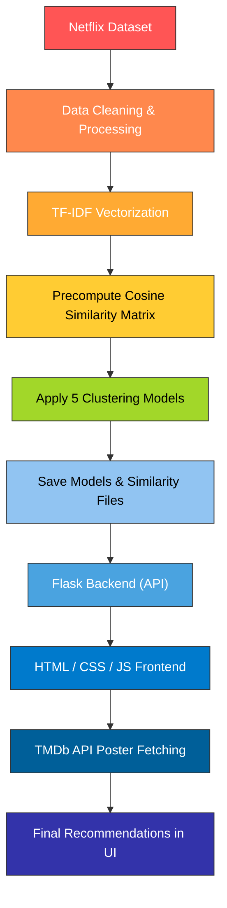

# media-clustering-and-recommendation
A complete end-to-end recommendation system using **Machine Learning, Deep Learning, and Clustering Algorithms**, deployed with **Flask** and powered by **TMDb API** for posters and descriptions.

<p align="center">
  
</p>

---

## 📌 **Project Overview**

This project builds a **content-based + clustering-enhanced recommendation engine** for Netflix Movies/TV Shows.  
It integrates:

- Data cleaning & preprocessing  
- Multiple clustering algorithms  
- TF-IDF vectorization  
- Cosine similarity  
- A Flask backend  
- Interactive web UI (HTML, CSS, JS)  
- TMDb API for real posters & metadata  

The system suggests similar Movies/TV shows based on:
- Title  
- Genre  
- Release Year  
- Type (Movie/TV Show)  
- Age Group  
- Description similarity  
- Cluster membership  

---

## 📂 **Dataset Used**

Dataset: [**Netflix Titles Dataset**](https://www.kaggle.com/datasets/shivamb/netflix-shows)
- Contains ≈ 8800+ titles  
- Columns include:
  - `title`
  - `director`
  - `cast`
  - `listed_in` (Genres)
  - `description`
  - `release_year`
  - `type` (Movie/TV Show)
  - `rating`
  - `duration`
  - Added features like **age_group** (engineered)

---

## 🧹 **Data Cleaning & Preprocessing**

The following cleaning steps were performed:

✔ Converted missing values → `"NA"`  
✔ Removed duplicates  
✔ Split multi-genre fields  
✔ Extracted `age_group` from `rating`  
✔ Standardized text formats  
✔ Dropped unnecessary columns  
✔ Built TF-IDF embeddings from description text  
✔ Generated numeric encodings for categorical clustering  

---

## ⚙️ **Feature Engineering**

To support multiple algorithms:

### **1️⃣ Text Features**
- TF-IDF Vectorization → `tfidf_vectorizer.pkl`
- Description embedding → `tfidf_matrix.npy`

### **2️⃣ Numerical & Mixed Features**
- One-hot encoding for genres
- Label encoding for type, rating
- Duration normalization
- Combination of categorical + numerical fields for K-Prototypes

### **3️⃣ Cosine Similarity Matrix**
Precomputed matrix: **cosine_sim.npy**

Used for fast real-time recommendations.

---

## 🤖 **Models & Algorithms Used**

This project implements **five different clustering-based methods**:

### **1️⃣ K-Prototypes**
Used because the Netflix dataset contains **mixed data types**:  
- Numerical: `release_year`, `duration`
- Categorical: `type`, `listed_in`

📌 K-Prototypes handles *both* numeric & categorical data, making it ideal.

---

### **2️⃣ HDBSCAN**
A density-based clustering algorithm.  
Used because:
- Netflix data has irregular distribution  
- Some titles do not fit any cluster  
- Automatically detects outliers/noise  

Perfect for real-world, non-uniform datasets.

---

### **3️⃣ Topic Modelling (LDA) + DBSCAN**
Workflow:
1. Extract topics from description using **LDA**  
2. Convert topic vectors → DBSCAN clustering  

Used because:
- Captures semantic similarity  
- Groups content based on themes  
- DBSCAN helps form clusters without specifying k

---

### **4️⃣ K-Means**
Used as a baseline clustering algorithm.  
Best for:
- High-dimensional numeric TF-IDF vectors  
- Fast and scalable clustering  

---

### **5️⃣ Deep Clustering**
Involves:
- Deep neural embeddings  
- Dimensionality reduction (autoencoders)  
- Clustering in latent space  

Used to capture complex semantic similarities that classic ML cannot.

---

## 🧠 **Recommendation Engine Logic**

Final recommendation uses:
- Cosine similarity (primary method)
- Optional clustering constraints
- Post-filtering based on user inputs

### **How it works**
1. User enters movie/show name
2. System finds index in the dataset
3. Retrieves all similarity scores
4. Sorts titles by similarity
5. Applies filters:
   - Genre
   - Release year
   - Type
   - Age group
6. Returns top 10 recommendations
7. Fetches posters via TMDb API
8. Displays results in UI

---

## 🔥 **Flow of the Entire System**



---


## 🖼️ **Screenshots & GIFs**

### 🎞️ **Homepage**
<p align="center">
  
</p>

### 🔍 **Search Suggestions**
<p align="center">
  
</p>

### 🎬 **Recommendation Output**
<p align="center">
  
</p>

---

## 📁 Project Structure

```bash
📁 Project/
│── app.py                     # Flask backend
│── recommendation.py          # Recommendation logic
│
│── UI/
│   └── index.html            # Main web interface
│
│── static/
│   ├── style.css              # Styling (UI/UX)
│   └── script.js              # Client-side logic
│
│── Data/
│   ├── netflix_titles.csv     # Netflix dataset
│   └── data.csv               # Engineered dataset
│
│── Model/
│   ├── cosine_sim.npy         # Cosine similarity matrix
│   ├── tfidf_vectorizer.pkl   # TF-IDF vectorizer
│   └── tfidf_matrix.npy       # TF-IDF matrix
│
│── README.md
```

---

## 🚀 **How to Run the Project**

### **1️⃣ Install dependencies**
```bash
pip install -r requirements.txt
```

### 2️⃣ Add your TMDb API Key

Create a `.env` file:
```bash
TMDB_API_KEY="your_key_here"
TMDB_BASE_URL="base_url"
TMDB_IMG_BASE="img_base"
```

### 3️⃣ Run Flask App
```bash
python app.py
```

---

## 🛠️ Tech Stack

## 🛠️ Tech Stack

| Category           | Technologies Used |
|-------------------|-------------------|
| **Backend**       | Flask |
| **Frontend**      | HTML, CSS, JavaScript |
| **Machine Learning** | Scikit-learn, NumPy, Pandas |
| **Topic Modelling** | LDA |
| **Clustering**    | K-Prototypes, HDBSCAN, LDA + DBSCAN, K-Means, Deep Clustering |
| **Visualization** | Matplotlib, Seaborn, Plotly |
| **Deployment**    | Local Flask Server |
| **External API**  | TMDb API |

---

## 📌 Key Features

- Real-time recommendation
- TMDb posters & info
- Auto-suggest search bar
- Filters: Genre, Type, Year, Age Group
- Hover card effects with movie details
- Integrated with multiple clustering approaches
- Fast cosine-similarity-based recommendation

---

## 🧾 License

This project is licensed under the **MIT License**.  
Feel free to use, modify, and distribute with attribution.